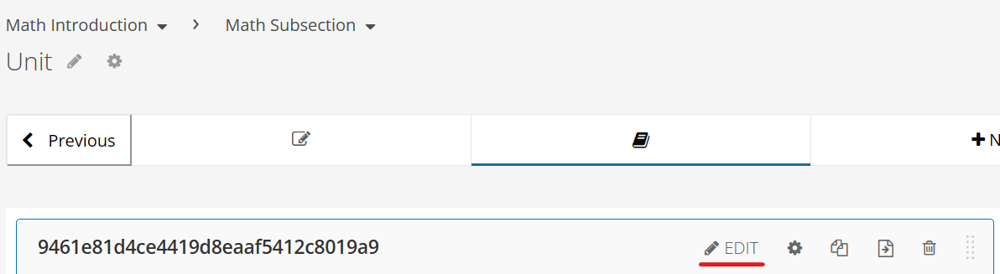
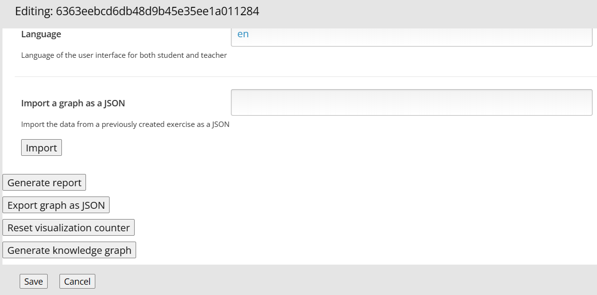
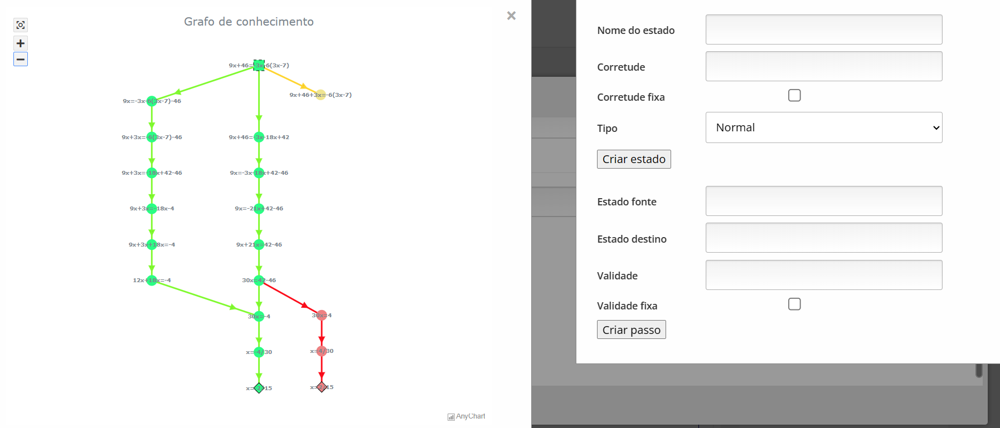
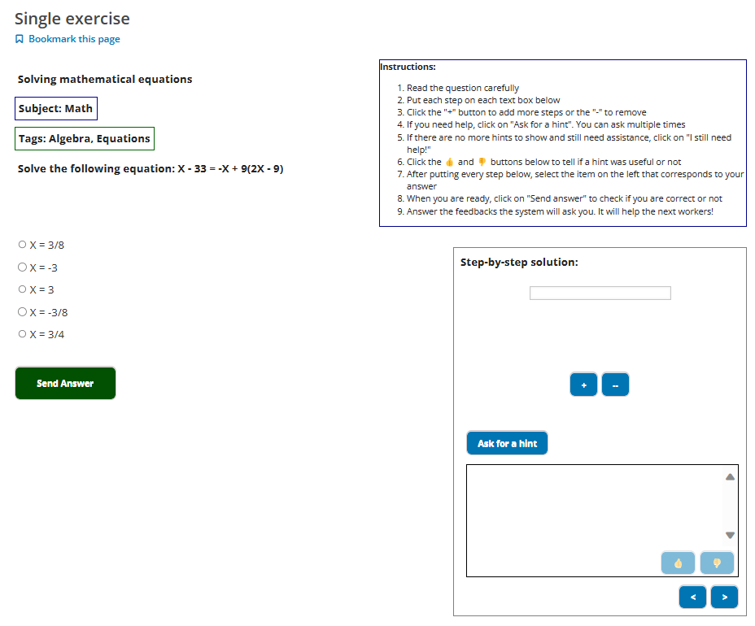
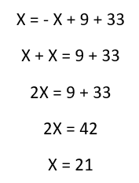
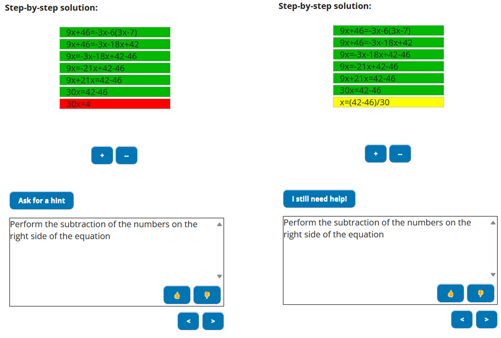
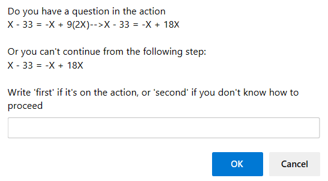

# How to use it
QUATIS have 2 main interfaces: the student and the teacher.
The teach can be used to configure the exercise and to edit the knowledge graph

The student one will be used by the **students**, which they will be able to complete the exercvise with a step-by-step solujtion, ask for help and send feedbacks during and after finishing the activity.

# Teacher's interface

## Initial configuratioon
After adding athe QUATIS component to the course, first, you need to click on the **Edit** button. This is important for the initial configuration

After clicking on that, a pop up will appear telling you that it will do an automatic first configuration.

## Changing the settings
After the initial configuratin, you can click again on the **Edit** button in order to configure your exercise, like the title, the alternatives ans which one are correct.

When you change these settings, always remember to click on the save button!

If you scroll down all to the end, you can click on the button to show the graph editor

After clicking on it, you will see the graph editor. It can be separated in 2 parts, the left where the graph itself will be shown, and the right, where you will be able to create or edit the nodes and edges.

Since the graph editor is complex, you can access it separately clicking [here](./GRAPH_EDITOR.md).

## Quick preview

When you finish editing the graph and customizing your exercise, click on the **View Live Version** located on the upper part to see a preview on how the student will see the exercfise in their devices.

While there already a preview when accessing the teacher's interface, it doesn't exactly replicate the student's real view. That's why we reccomend checking the live version.

# Student's interface

In the case of students, they will use QUATIS to solve the exercises.

On the left, the exercise information like title, description, tags and alternatives can be found. On the right, you have some simplified instructions for the students, the step-by-step solution and finally the feedbacks that will help studentsd in need.

## Solution

To properly use QUATIS, we expect that the students will do a step-by-step solution, which means that each node of the graph is a step here in the interface. 
We also reccomend for better visibility later, that every solution starts with the same initial step, for example the initial equation which is on the title.

The student can press both **+** and **-** buttons to add or remove lines from the solution. 

## Asking for hints

During the exercise, the student can press the button **Ask for a hint** at any time. QUATIS will analyze the current solution from the student and from there show the most appropriate hint or explanations. Also, each step will be painted with a color so the student can understand how they are proceding in the exercise:

- Green: the step is correct
- Red: the step is incorrect
- Yellow: QUATIS doesn't know if it's correct or not

How QUATIS wouldn't know if it's correct or not? In those cases, the step was obtained from the students, so it's still needs to obtain more information about it before making sure it's correct or not. 
Another option would be the teacher manually checking of it1's correct or not.

The hint will be appear below the steps. The students can vote if the it was useful or not using the **like** and **dislike** buttons

## Asking questions

When all available hints were shown to the student, it could mean that he/she still doesn't know how to proceed, and also means that the available hints weren't enough to help.

In those cases, the student have the option to see existing or create new questions that can be answered by other students, or by the teacher on the graph editor.

## Finalizing the exercise

When the student finishes the exercise, heshe will select one of the available options on the left, and after that click on the **Send button**.
The system will show if your solution is correct, incorrect or if it's in analysis

After sending your solution, the system may the student for more information (for example explaining a step or checking if its correct or not)
