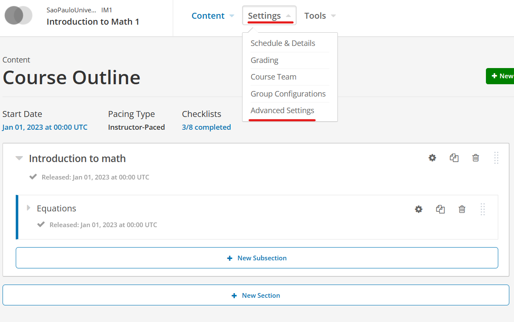
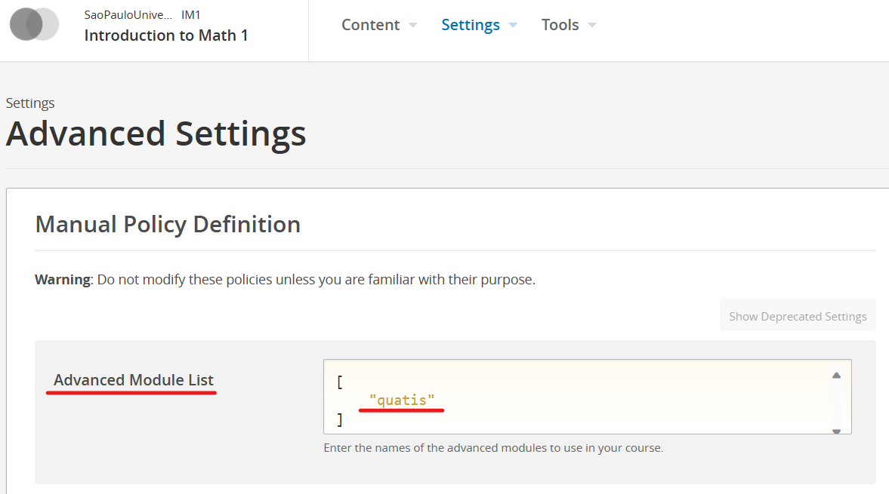
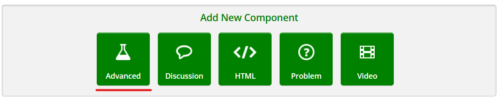

# How to install it?

Since there are some instructions, lilke adding new tables and restarting apache, that may vary between systems, we added a step-by-step instuctions to help you in the guide. Any questions please feel free to ask.

## 1- Install dependencies

First, we need to add the following Python libraries:

    pip install unidecode
    pip install python-levenshtein

## 2 - Create necessary tables
After that, you need to create all tables. Please login to the MySQL DB, and run the following commands to create the necessary tables:

[SQL file](./readme_stuff/full_migration.sql)

## 3 - Install main package
Install the QUATIS Xblock as a python package:

    pip install quatis

## 4 - Restart apache
After the installation, it's necessary to restart apache so the installation can take effect. The command to restart it varies between systems. Here are some examples (yours may be different from the ones liested below. Use then as examples):

    sudo service apache2 restart
    sudo systemctl restart apache2
    sudo /etc/init.d/apache2 restart

## 5 - Configure the course
Access the edX Studio, and in the course that you want to add the QUATIS, click on the **Settings** and then on the **Advanced Settings**, which are both located in the upper part of the interface

After that, add **"quatis"** (with quotes) on the **Advanced Module List** and save the changes

Finally, when you add a new component on a section of your couse, you can click on the **Advanced** and select **quatis**

