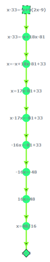
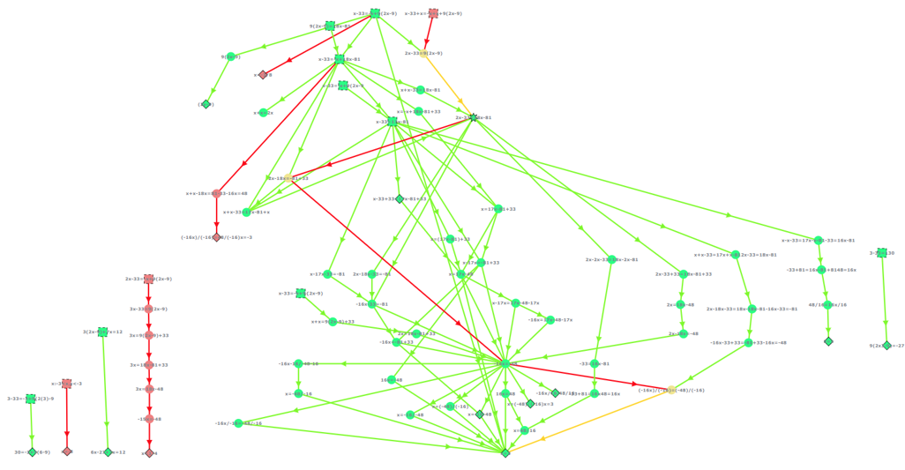
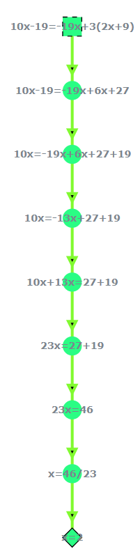
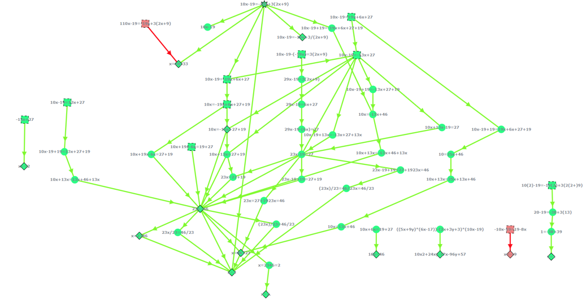
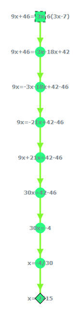
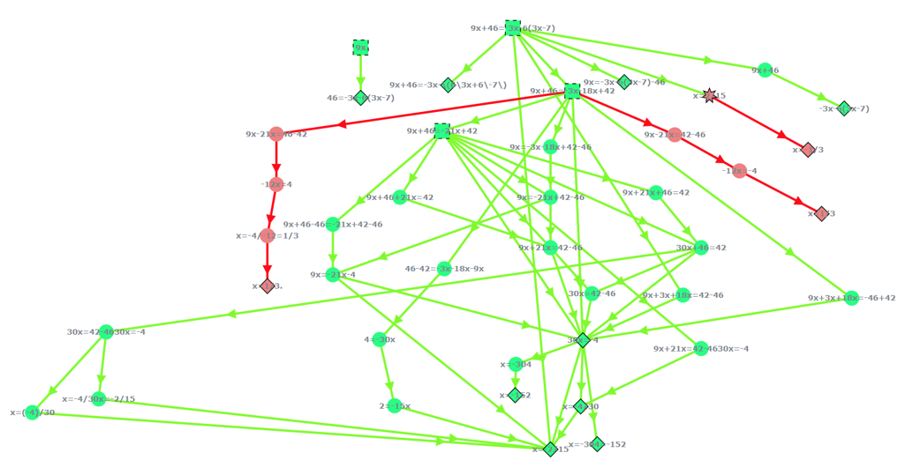

# Proof of Concept

During the development of QUATIS, a proof of concept was conducted to check how the utilization of QUATIS could decrease the amount of work for teachers.

How could QUATIS help improve the experience in general for teachers?

## Technical details

To gather participants for the proof of concept, Amazon Mechanical Turk (MTurk) was used, where people can be asked to do an activity like answering a few questions or solving a simple problem, for a small amount of money.

To choose who would be part of the proof of concept, multiple HITs (Human Intelligence Tasks) were created to properly filter which participants would be selected.

For the MTurkers to access QUATIS, it was executed on a personal laptop connected to the internet.

## Execution

The MTurkers were expected to fill in some details and solve one simple mathematical equation.

Equations were chosen for this proof of concept because equations are naturally solved in a step-by-step method, which is perfect to test with QUATIS.

Each of the exercises had a really simple graph, representing only a single solution. We expected that MTurkers, when solving the equation with different strategies, would populate the graph with these new solutions.

After executing the experiment, we noticed that a lot of MTurkers didn't solve the exercise correctly. So initially, a cleanup was done by removing any answers that weren't steps to solve an equation.

After the cleanup, we were able to obtain multiple solutions for each graph. Below we will show how the graphs evolved in just 3 days:

### Exercise 1: X - 33 = -X + 9(2X-9)

Initial graph:

Graph after 3 days:

### Exercise 2: 10X - 19 = -19X + 3(2X + 9)

Initial graph:

Graph after 3 days:

### Exercise 3: 9X + 46 = -3X -6(3X-7)

Initial graph:

Graph after 3 days:

## Results

Above you could see how many solutions we were able to produce from the MTurkers. Now analyzing the data with more details, we were able to find that:

* 60.7% of the new states from the graph already had a correct value for correctness, which means that the teacher wouldn't need to correct these
* In the case of edges of the graph, 67.1% of them already had the validity correct, further decreasing the amount of work for teachers
* Where each graph had one single solution, more than 3000 new solutions were generated
* 7 new feedbacks that could be helpful to new students were found

Along with the points above, the teacher could also check the newly generated graph and learn from it, such as a unique solution that wasn't expected, a common wrong solution that could be used to teach students, and many others.

While this was only a proof of concept, and a proper experiment is needed to better measure the impact of QUATIS in obtaining data through collective intelligence to help teachers, we were still able to get a good idea of how we could proceed.