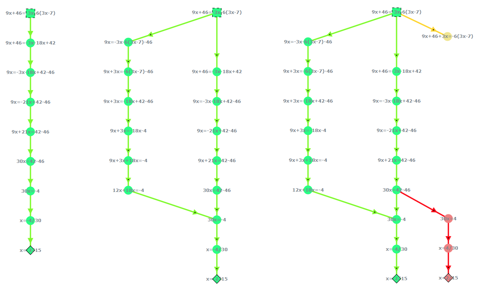

# Hello, and welcome to QUATIS!

**QUATIS** is an acronymn for **Q**uick and **U**ncomplicated **A**uthoring **T**ools for **I**ntelligent tutoring **S**ystems.
This tool was developed in order to facilitate the work needed for teachers to produce and also as a master's degree project.

# What's an Intelligent Tutoring System?
Intelligent Tutoring Systems (ITS) are computer programs aimed at helping students to learn new knolwegde by simulating a individual learning, with one student and one teacher.
This is because the ITS doesn't just show if the answer is correct or not, but it also help depending of the solution used.

To understand the many possibilities of solving a exercise (for example a math equation), QUATIS needs to represent these possibilities in some way. 
QUATIS utilizes directed graphs to represent. For example, in the math equation: X + 46 = 3X - 6 (3X-7)

Every graph have 2 main elements, which are the nodes (which are the checkpoints of a solution) and edges (which are the actions that makes a move from one node to another). The image above shows, from left to right, how the equation may have only oner solution to multiple, including wrong ones (in red).

# And how does the QUATIS help for ITS?
Even though the ITS are useful, they are complicated to produce for many reasons:
- They are difficult to develop, since they need both programming and AI knowledge. What if a teacher wan't to create their own ITS?
- They take a lot of time to configure, since it's needed to configure each possibility of solving the exercise to be manually
- If A student uses a right solution that wasn't added by the teacher, it won't count as correct

QUATIS includes few key features that all work together in order to decrease the difficulties when developing and configuring exercises in ITSs.

## Authoring tools 
These are programs that are used to create ITS without the need for programming and AI knowledge. So teachers will be able to create their own exercises with only the subject knowledge
 
## Collective Intelligence (CI)
CI is the idea of using a group of individuals in order to overcome a existing problem or make better results of it.

When students are completing exercises on ITS, they will use their ste-by-step to solve the exercise. Normally the teacher would only obtain the results if the studnet answered the exercise correctly, but there's a lot of knoiwledge from students that goes unoticed, like other solutions that were tried before ther final one, if a hint that was received was useful or not, or an explanation on why a certain step is correct

With the CI, we will use the knolwedge from students both directly and undirectly. With it, we will be able to obtain the follwoing information
- **New solutions**: what if the teacher forgot to add a specific solution and a student uses it? Any new solution from students that did not exist before will be added
- **New feedbacks**: After the student finished the exercise, we could ask then if they can explain why their solution is correct, why another solution is incorrect or to give a hint in a certain step. These explanations and hints can be used tyo help future students
- **Doubts**: What if the feedbacks did not help the students and they still need help? Students can send create doubts, that can be answered by other students or the teacher. Future studnets will be able to check existing doubts and ther answers to also help then

While the data that was created by the students can help the teacher by decreasing the amount of work and time needed, there's a possible problem with then. Since the data came from student's, they are not necessarily correct, so the teacher must also check, from time to time, if the data is correct or not.
But how the teacher can check these informations?

## Graph Editor
As mentioned above, the teacher will need to check from time to time if the data from students are correct. This is where the Graph editor will help the teacher to both configure the exercise initially, and to also check the student data later.

This is the most unique feature of the QuATIS system. On other documentations you will see how it works to add or edit information on the graph.

# How is general procedure to use QUATIS?
Supposinng a teacher will use QUATIS to create an exercise, and the students will do it, it will probably follow the order

1. The teacher adds the exercise, and customize both the data (like title and descrption) and the knowledge graph
2. Students will start doing the exercise
3. Student's data, like new solutions and feedbacks, are added to the graph
4. From time to time, the teacher will check the graph and correct it

You can check [here](./PROOF_OF_CONCEPT.md) to see QUATIS in action in a small proof of concept, seeing how collective intelligence can help teachers to not just decrease the amount of work, but also to learn more about their students and their solutions.

# First steps
## Installation
First nof all, you need to be using the Open edX platform in order to use the QUATIS, since it's a XBlock. You also need access to the edX system, because since QUATIS is more complex than normal componenets, the installation process won't be as simple as others.

Click [here](./INSTALL.md) to access the Installation instructions.

## Using it
After successfully installing, click [here](./HOW_TO.md) to access the guide and how to use it.

# Afterward

## Techincal details
Click [here](./TECHNICAL.md) to access the documentation for the technical details of QUATIS, as well as here to access the commands that you can do to access the  system